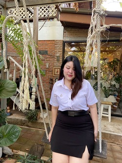

# Deliverables Sprint#2

- **Docker images :** [undainthanate/g4](https://hub.docker.com/repository/docker/undainthanate/g4/general)
- **User manual :** [User manual](https://github.com/undainthanatekku/SoftwareEngineer_G4/blob/f8abbdf403a170ef92d4d3fc4c22c3686a96e48e/Deliverables%20Sprint%232/Usermanual.pdf)
- **DoD:** [DoD](https://github.com/undainthanatekku/SoftwareEngineer_G4/blob/cf639d33634a60005110ccae3760c33a0f2dbccc/Deliverables%20Sprint%232/Do_Done.pdf)
- **Sprint backlog + Burndown chart:** [Sprint backlog + Burndown chart](https://github.com/undainthanatekku/SoftwareEngineer_G4/blob/d39e96b4c1538dd9c3059913df7892b0c521783c/Deliverables%20Sprint%232/Sprint%20backlog%20%2B%20Burndown%20chart.pdf)
- **User Acceptance Test:** [User Acceptance Test](https://github.com/undainthanatekku/SoftwareEngineer_G4/blob/4082a736e574ed28e9690921174b728746a8d17f/Deliverables%20Sprint%232/Sprint_2_TestScript.pdf)
- **Presentation:** [Presentation](https://github.com/undainthanatekku/SoftwareEngineer_G4/blob/336f72c4fa26547e25e4f92df7e95c73c0e5722b/Deliverables%20Sprint%232/%E0%B8%9E%E0%B8%A3%E0%B8%B5%E0%B9%80%E0%B8%8B%E0%B8%99%E0%B8%95%E0%B9%8C%E0%B8%81%E0%B8%A5%E0%B8%B8%E0%B9%88%E0%B8%A14_sec.4.pdf)
- **A-DAPT Blueprint:** [A-DAPT Blueprint](https://github.com/undainthanatekku/SoftwareEngineer_G4/blob/8727b69369f2341edd117dc04d2a6817c06354c1/Deliverables%20Sprint%232/Usermanual.pdf)
# Lab9 - Kick off

- **Docker images :** [undainthanate/g4](https://hub.docker.com/repository/docker/undainthanate/g4/general)
- **User manual :** https://github.com/undainthanatekku/SoftwareEngineer_G4/blob/main/files/User_manual.pdf
- **DoD:** https://miro.com/welcomeonboard/NnR6RTQzdkwyZjg3c2M5ZENuenRSbDBWOGxiZVBuOFB1MUVxb3BzWFRIOU01Q1pCaWZ5U2hPN1JwblVWREJYa3wzNDU4NzY0NTQwMDA5Njc0MTMzfDI=?share_link_id=739614933877
- **Test & Sprint backlog + Burndown chart:** https://github.com/undainthanatekku/SoftwareEngineer_G4/blob/main/files/test_case.xlsx & https://github.com/undainthanatekku/SoftwareEngineer_G4/blob/main/files/sprint.xlsx
- **Presentation:** https://www.canva.com/design/DAF3T1rKNWs/u6URWnZnaTdwzBXMKFNeeg/edit

# Team Development Project

## Contributor Information

- **Name:** Unda Inthanate
- **Student ID:** 643020659-1
- **Section:** 4
- **GitHub Username:** [undainthanatekku](https://github.com/undainthanatekku)

---

- **Name:** Pativat Kongsawat
- **Student ID:** 643020621-6
- **Section:** 4
- **GitHub Username:** [pativatkongsawat](https://github.com/pativatkongsawat)

---

- **Name:** Yarnnawit Robthaisong
- **Student ID:** 643020604-6
- **Section:** 4
- **GitHub Username:** [yarnnawitrobthaisong](https://github.com/Yarnnawitch)

---

- **Name:** Sarisa Thungthong
- **Student ID:** 643021438-2
- **Section:** 4
- **GitHub Username:** [sarisa-28](https://github.com/sarisa-28)

---

- **Name:** Nuengtida Sangcha
- **Student ID:** 643021344-1
- **Section:** 4
- **GitHub Username:** [nuengtida](https://github.com/nuengtida)

---

- **Name:** Siriyakorn Eaksiri
- **Student ID:** 643020650-9
- **Section:** 4
- **GitHub Username:** [ssiriyakorn](https://github.com/ssiriyakorn)

---

- **Name:** Peerapath Sriwattanasup
- **Student ID:** 643021331-0
- **Section:** 4
- **GitHub Username:** [PeerapathSriwattanasup](https://github.com/PeerapathSriwattanasup)

---
